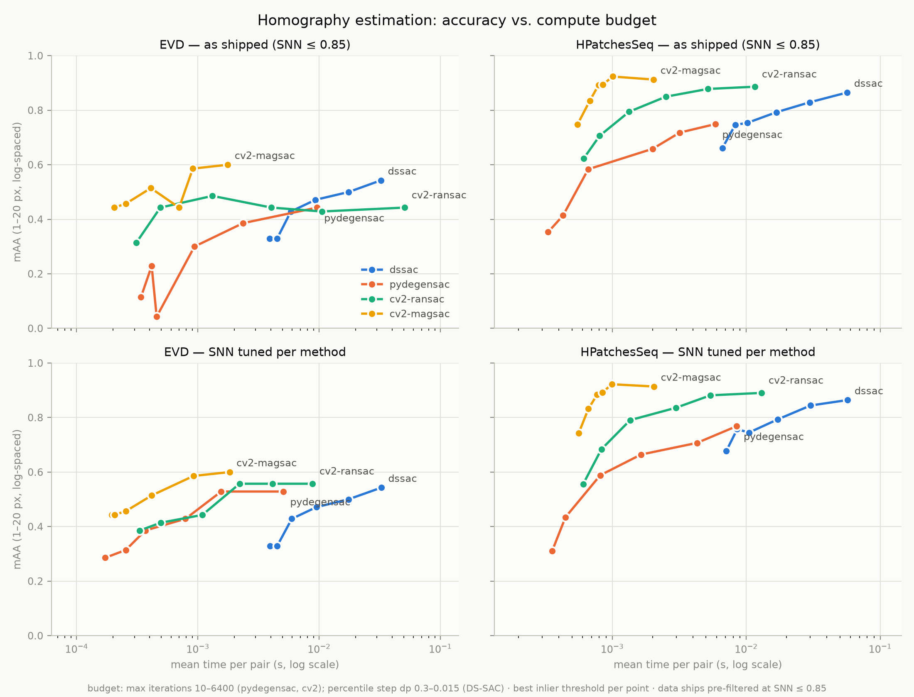

# DS-SAC — homography

A pure-NumPy implementation of DS-SAC (Density Search for Sample Consensus,
[arXiv:2607.03972](https://arxiv.org/abs/2607.03972), Thapa & Islam) for the homography case,
benchmarked on the CVPR-2020 RANSAC tutorial data.

This is an **independent, open-source reimplementation** written from the paper. It is not the
authors' code and has not been checked against it; treat it as a from-scratch implementation of
the homography case described in the paper.

DS-SAC is deterministic — no random minimal sampling. Starting from a least-squares fit on all
points of the current partition, it does a **forward percentile-descent search** (shrinking the
point set used for refitting), a **backward expansion** back out from the best percentile found,
and **recursive partitioning** of the point set by the sign of the fitted model's residual, so
different sub-populations (e.g. distinct planes) are searched separately. A final **post-tuning**
pass refits the global-best model on inlier sets at relaxed-to-strict thresholds.

## Install

```bash
pip install -e .
```

Runtime dependency: `numpy` only. Requires Python >= 3.10.

## Usage

```python
import dssac

H, mask = dssac.find_homography(pts1, pts2, threshold=2.0)
```

`pts1`, `pts2` are `(N, 2)` arrays of corresponding points; the call returns a `3x3` homography
`H` (with `H[2, 2] == 1` when possible) mapping `pts1 -> pts2`, and a boolean inlier `mask`, or
`(None, None)` on failure.

Parameters:

- `threshold` (px): one-way transfer-error inlier threshold.
- `dp` (default `0.03`): percentile step used by the forward/backward search.
- `p_min` (default `0.2`): minimum search percentile, and minimum fraction of the parent
  partition a recursive split must retain to be searched further.
- `post_tuning_ks` (default `(3, 2, 1.5, 1)`): multipliers of `threshold` used by the
  relaxed-to-strict post-tuning refit chain.

The estimator is fully deterministic: the same inputs always produce the same output, with no
random sampling and nothing to seed.

## Benchmark

Reproduce with:

```bash
bench/setup_data.sh
.venv/bin/python bench/run_bench.py
.venv/bin/python bench/report.py
```

`bench/setup_data.sh` clones
[ransac-tutorial-2020-data](https://github.com/ducha-aiki/ransac-tutorial-2020-data) and fetches
the tutorial's `homography.tar.gz` correspondence archive.

Protocol: the tutorial's `val` split of EVD (7 pairs) and HPatchesSeq (145 pairs), each with
precomputed tentative correspondences and ground-truth homographies. In the default protocol all
methods receive the same correspondences **as shipped** — note the archive is already
pre-filtered at SNN ratio ≈ 0.85, so "no additional filtering" still means a 0.85 ratio test.
Metric is the tutorial's mean absolute reprojection error on the jointly-visible region,
aggregated into mAA over the tutorial's log-spaced 1–20 px threshold set. Baseline methods
(OpenCV RANSAC, OpenCV MAGSAC++, pydegensac) are capped at 2000 iterations, confidence 0.999;
DS-SAC has no iteration cap since it is deterministic. Each method is swept at inlier thresholds
{0.5, 0.75, 1, 2, 4} px; the SNN-filtered protocol additionally sweeps the ratio threshold
{0.6, 0.65, 0.7, 0.75, 0.8, 0.85, 1.0}:

```bash
.venv/bin/python bench/run_bench.py --snn 0.6 0.65 0.7 0.75 0.8 0.85 1.0 --out results/results_snn.jsonl
.venv/bin/python bench/tune_snn.py     # staged tuning table + results/best_snn.json
```

## Results

Best-per-method rows (highest mAA across the threshold sweep), from `results/report.md`:

Best per method (EVD):
| method | th (px) | mAA | median err | mean time (s) |
|---|---|---|---|---|
| cv2-magsac | 0.5 | 0.5857 | 4.24 | 0.0017 |
| dssac | 1.0 | 0.5000 | 4.73 | 0.0177 |
| cv2-ransac | 4.0 | 0.4286 | 5.14 | 0.0126 |
| pydegensac | 1.0 | 0.4143 | 5.08 | 0.0029 |

Best per method (HPatchesSeq):
| method | th (px) | mAA | median err | mean time (s) |
|---|---|---|---|---|
| cv2-magsac | 0.5 | 0.9152 | 0.50 | 0.0023 |
| cv2-ransac | 4.0 | 0.8786 | 0.69 | 0.0059 |
| dssac | 4.0 | 0.8290 | 0.63 | 0.0303 |
| pydegensac | 0.5 | 0.7276 | 1.51 | 0.0068 |

Full per-threshold tables are in `results/report.md` (regenerated locally, not tracked in git).

### SNN-filtered protocol

Staged tuning (per method and dataset: best SNN ratio at the as-shipped best inlier threshold,
then inlier threshold re-tuned at that SNN), from `bench/tune_snn.py`:

| dataset | method | th@snn=1.0 | mAA@snn=1.0 | best snn | mAA stage1 | re-tuned th | mAA stage2 |
|---|---|---|---|---|---|---|---|
| EVD | cv2-magsac | 0.5 | 0.5857 | 1.0 | 0.5857 | 0.5 | 0.5857 |
| EVD | cv2-ransac | 4.0 | 0.4286 | 0.75 | 0.5571 | 4.0 | 0.5571 |
| EVD | dssac | 1.0 | 0.5000 | 1.0 | 0.5000 | 1.0 | 0.5000 |
| EVD | pydegensac | 1.0 | 0.4286 | 0.7 | 0.5000 | 0.75 | 0.5714 |
| HPatchesSeq | cv2-magsac | 0.5 | 0.9152 | 0.85 | 0.9166 | 0.5 | 0.9166 |
| HPatchesSeq | cv2-ransac | 4.0 | 0.8786 | 0.7 | 0.8807 | 4.0 | 0.8807 |
| HPatchesSeq | dssac | 4.0 | 0.8290 | 0.85 | 0.8441 | 4.0 | 0.8441 |
| HPatchesSeq | pydegensac | 1.0 | 0.7083 | 0.85 | 0.7255 | 0.5 | 0.7276 |

Takeaways: SNN tuning matters most on EVD, where it lifts pydegensac from 0.43 to **0.57**
(ahead of DS-SAC's 0.50) and cv2-RANSAC to 0.56; DS-SAC's own optimum on EVD is *no extra
filtering* — it prefers to see all the correspondences and reject outliers itself. On
HPatchesSeq the gains are small for every method (the shipped 0.85 pre-filter is already close
to optimal there).

Caveats:

- DS-SAC here is pure NumPy while all three baselines are compiled C++ (OpenCV, pydegensac); the
  runtime column is indicative only, not an apples-to-apples speed comparison.
- The archive's tentative correspondences are already SNN-pre-filtered at ≈ 0.85, so the default
  protocol is not a truly unfiltered regime; the SNN-filtered protocol above tunes the ratio
  further per method.
- Both validation sets are small — EVD is only 7 pairs — so differences of a few percent in mAA
  should be treated as noise rather than a reliable ranking, especially on EVD.
- The "best per method" tables report each method at its own best inlier threshold from the sweep,
  i.e. a per-method-tuned operating point, not a single fixed protocol.
- The RANSAC-family baselines are not seeded (pydegensac and OpenCV use internal randomness), so
  their exact figures vary slightly run to run; only DS-SAC is bit-exact reproducible.

### Accuracy vs. compute budget



Each point is one compute budget — `maxIters` 10–6400 for the RANSAC-family baselines, percentile
step `dp` 0.3–0.015 for DS-SAC (its natural budget knob, since it is deterministic and has no
iteration cap) — with x = measured mean runtime per pair and y = the method's best mAA over the
inlier-threshold sweep at that budget. Top row: correspondences as shipped (SNN ≤ 0.85); bottom
row: each method at its tuned SNN threshold from `results/best_snn.json`. DS-SAC's runtime is
flat across inlier thresholds (no confidence-based early exit) and its cheap-budget end is
bounded below by the partition-tree overhead, so its curve spans a narrower time range than the
iteration-capped baselines.

Reproduce:

```bash
.venv/bin/python bench/time_maa.py        # ~10 min, writes results/time_maa.jsonl
.venv/bin/python bench/time_maa.py --snn-json results/best_snn.json --out results/time_maa_snn.jsonl
.venv/bin/python bench/plot_time_maa.py --results-snn results/time_maa_snn.jsonl
```

## Implementation notes

Hyperparameters follow the paper's stated defaults: percentile step `Δp = 0.03`, minimum
percentile `p_min = 0.2`, and default inlier threshold `T = 5.99·σ²` with `σ = 0.3` px
(≈ 0.54 px) — all exposed as function arguments and overridable.

Two points where the paper is underspecified are resolved here as documented assumptions:

- **Post-tuning multiplier sequence**: the paper does not specify the exact relaxed-to-strict
  `k` sequence used to refit inlier sets in the post-tuning pass; this implementation uses
  `k = (3, 2, 1.5, 1)`, chosen by us and configurable via `post_tuning_ks`.
- **Inlier-optimization adoption**: within each search round, the model from the inlier-set
  refit (as opposed to the percentile-set refit) is only carried forward into the next round if
  it strictly improves the best-so-far score for that search; otherwise the percentile-refit
  model is kept.

See `docs/superpowers/specs/2026-07-23-dssac-homography-design.md` for the full design spec and
`docs/superpowers/plans/2026-07-23-dssac-homography.md` for the step-by-step implementation plan
and task-by-task notes.

## Citation

```bibtex
@article{thapa2026dssac,
  title   = {DS-SAC: Density Search for Sample Consensus},
  author  = {Thapa, Suraj and Islam, Muhammad Aminul},
  journal = {arXiv preprint arXiv:2607.03972},
  year    = {2026}
}
```
